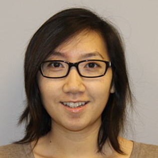

 
[LinkedIn](https://www.linkedin.com/in/michelleyho/)  [Resume](https://github.com/michelleyho/michelleyho.github.io/blob/main/assets/resumes/MichelleHo_Resume_July_2025.pdf)
[Blog](https://michelleyho.github.io/blog/)
[Portfolio](https://michelleyho.github.io/portfolio/)

## Professional Experience
<h3 style="margin-bottom:2px;">Intel </h3>

<b>Software Engineer - Infrastructure, Automation, Build & Release</b> 
2017 - 2024

<ul style="margin-left: -1.4em;">
</ul>

<h3 style="margin-bottom:2px;">Cisco</h3>

<b>ASIC Verification Engineer</b> 
2011 - 2017

<ul style="margin-left: -1.4em;">
</ul>

<h3 style="margin-bottom:2px;">Raytheon Missiles Systems</h3>

<b>Electrical Engineer Intern</b> 
Summer 2009, Summer 2010

<ul style="margin-left: -1.4em;">
</ul>

<h3 style="margin-bottom:2px;">IBM</h3>

<b>IMS Database Intern</b> 
Summer 2008

<ul style="margin-left: -1.4em;">
</ul>

<h3 style="margin-bottom:2px;">Micron Technologies</h3>

<b>NAND Flash Quality Assurance Intern</b> 
Summer 2007

<ul style="margin-left: -1.4em;">
</ul>

## Leadership Experience
<h3 style="margin-bottom:2px;">Women Who Code - Silicon Valley Chapter </h3>

<b>Director, Leader, Volunteer</b> 
2016 - 2024

<ul style="margin-left: -1.4em;">
</ul>

## Volunteer Work
<h3 style="margin-bottom:2px;">Intel AI for Good</h3>

<b>Flask Developer </b> 
2019 

<ul style="margin-left: -1.4em;">
</ul>
